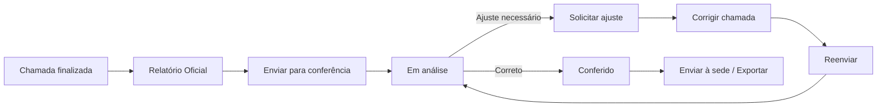
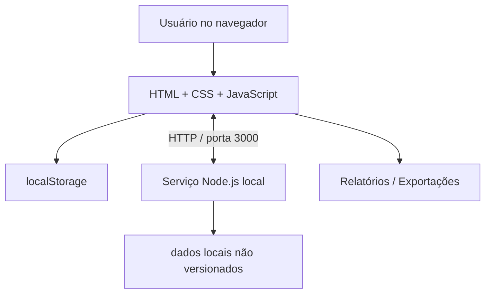

# Sistema JD Ivone

> Protótipo funcional de uma plataforma web para gestão de frequência, participantes, turmas, permissões, relatórios e conferência de informações da Escola Bíblica Dominical.


## Sobre o projeto

O Sistema JD Ivone nasceu da digitalização de um processo que antes dependia de registros manuais: chamada, consolidação de frequência, acompanhamento por turma, pontuação, relatórios gerenciais e conferência dos dados.

O objetivo do projeto é demonstrar como regras de negócio, rastreabilidade, controle de acesso e experiência de uso podem ser combinados em um sistema administrativo simples de operar.

## Destaques

- cadastro e acompanhamento de participantes;
- estrutura de Perfis, Grupos e Turmas;
- registro de chamada e histórico;
- regras de pontuação/Feirinha;
- matriz de permissões por Grupo;
- relatórios operacionais e gerenciais;
- Relatório Oficial EBD com exportação/impressão;
- fluxo de **Conferência de Relatórios** com rastreabilidade;
- solicitação de ajuste, correção, reenvio e reabertura versionada;
- auditoria das ações críticas;
- importação e exportação;
- serviço Node.js para compartilhamento local do estado entre dispositivos na mesma rede.

## Evolução de produto: aprovação → conferência

Na V15.5, o projeto abandonou uma tela separada de “aprovação”. A análise mostrou que o aprovador já precisava consultar o relatório para tomar uma decisão. O fluxo foi simplificado para que o **Relatório Oficial seja o centro do processo**:



Cada transição registra responsável, data/hora e observações relevantes.

## Arquitetura atual



A arquitetura atual é propositalmente de **protótipo local**. O roadmap de produção prevê banco relacional, autenticação e autorização no servidor e auditoria persistente.

## Estrutura

```text
.
├── Backend/
│   ├── server.js
│   ├── package.json
│   └── *.example.json
├── Front_End/
│   └── sistema-chamada-frontend/
│       ├── admin/
│       ├── assets/
│       ├── css/
│       ├── js/
│       └── *.html
├── docs/
├── .gitignore
├── CHANGELOG.md
└── README.md
```

## Executando localmente

### Requisitos

- Node.js 18 ou superior;
- navegador moderno;
- um servidor estático para o front-end (VS Code Live Server ou equivalente).

### Serviço local

```bash
cd Backend
npm start
```

O serviço inicia em `http://localhost:3000`. O endpoint de saúde é `/api/health`.

### Front-end

Em outro terminal, por exemplo:

```bash
python -m http.server 5500 -d Front_End/sistema-chamada-frontend
```

Depois acesse `http://localhost:5500`.

## Privacidade

Esta edição de portfólio **não contém a base real de participantes nem o estado local do sistema**. Os arquivos `Backend/banco.json` e `Backend/dados-compartilhados.json` são ignorados pelo Git. Há arquivos `.example.json` apenas com dados fictícios.

## Qualidade e validação

A V15.5 foi submetida a validações de sintaxe, integridade de links, smoke HTTP, migração de estados legados, permissões e simulação do fluxo normal/inverso de conferência. Consulte [`docs/TESTING.md`](docs/TESTING.md).

## Documentação técnica

- [Arquitetura](docs/ARCHITECTURE.md)
- [Regras de negócio](docs/BUSINESS_RULES.md)
- [Decisão de arquitetura: Conferência de Relatórios](docs/ADR-001-CONFERENCIA-RELATORIOS.md)
- [Testes e validação](docs/TESTING.md)
- [Segurança e limitações](docs/SECURITY.md)
- [Roadmap](docs/ROADMAP.md)

## Estado do projeto

**V15.5 — protótipo funcional.** O repositório é uma edição preparada para apresentação técnica e portfólio; não deve ser tratado como aplicação pronta para produção sem a evolução de segurança e persistência descrita no roadmap.
